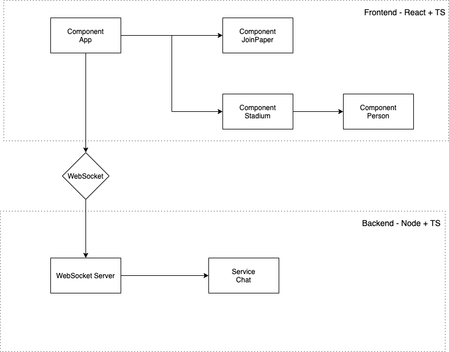

# Talk to Me!

This is a challenge project made for Tribe. It uses WebSockets, NodeJS, TypeScript and React.

I actually had a lot of fun doing it :)

## How it works

Just input your name when prompted, and start talking with other users in real time! :)

## Block Diagram



Frontend Components:

- **App**: The entry point of the React application, it handles the main page and holds the majority of the front end state
- **JoinPaper**: A simple paper used as the page to "login" to the app. It's the first screen you see when logging in
- **Stadium**: The "Blue Box" that initially contains all of the users
- **Person**: The Person Icon and its related components, like name and bubble chat

Backend:

- **WebSocket Server**: There is only one connection per client, and it is a WS connection.
- **Chat Service**: The backend service that holds the overall application state.

## Installation

Same commands as a create-react-app project

```bash
$ yarn
$ yarn start // run
$ yarn build // build
```

## Improvements

A lot of decisions were taken during the implementation of the project due to the deadline, so some improvements are:

- Use a centralized way to send events to the WebSocket server
- Add a barrier so users can't go out of the screen
- Reset timeout if 2 messages are sent
- Add tests
- And others!

## Challenges

Some aspects of the project were really challenging for me, as such:

- TypeScript: This is the first time I've coded using TypeScript. It adds some really cool features and I liked it, but having to learn everything today, it didn't make things easier. It was easy to use it considering my JS experience, but it took me some time to start understanding some troubleshoot stuff.

- WebSockets: This is roughly my second time coding with WebSockets in Node, but fortunatelly, this wasn't a big problem, I just had to remember a couple of stuff :)

## Live Demo

TBD
